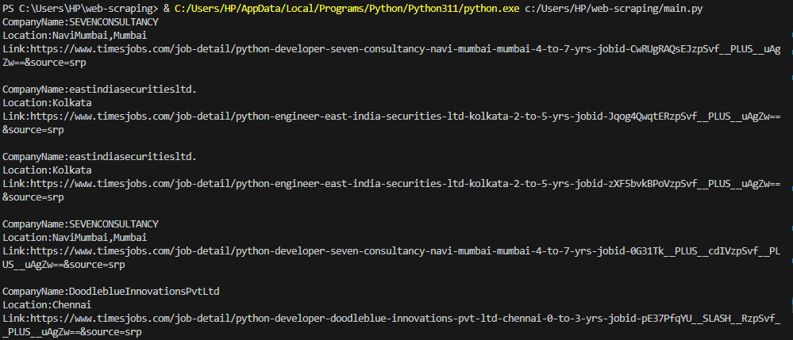
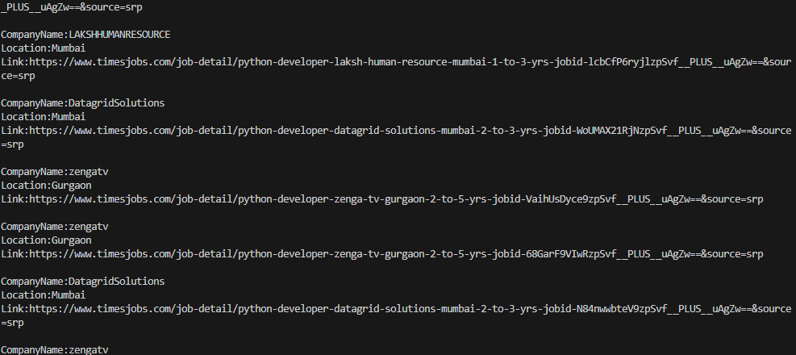

# Objective

This is a project which I made while learning about Web Scraping. In this, jobs from timesjobs.com are being scraped and desired details such as Company Name, Link of Job Post, and Location of Jobs are displayed 

# Output

